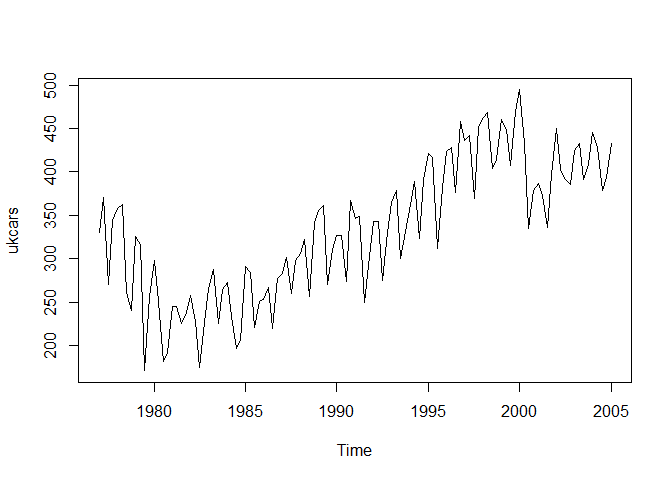
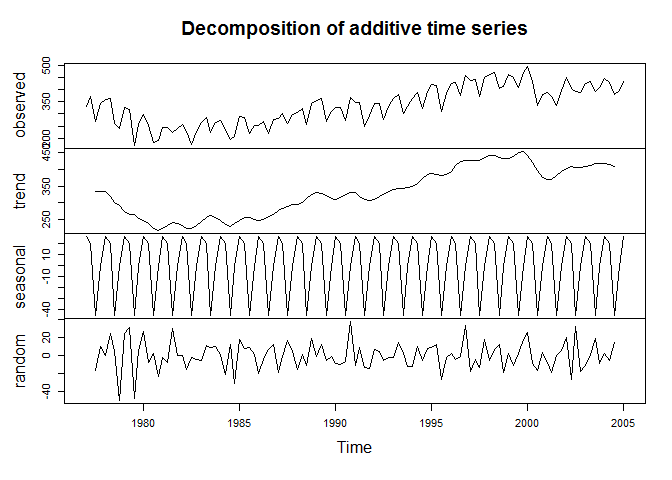

# Live Session Unit 11 Assignment
Victor Yim  
November 17, 2016  
1)	Go through the electric equipment example.   

More examples of forecasting! 
  Code to load data:  


```r
  library(fpp) #fpp package must be installed first
```

```
## Warning: package 'fpp' was built under R version 3.3.2
```

```
## Loading required package: forecast
```

```
## Warning: package 'forecast' was built under R version 3.3.2
```

```
## Loading required package: zoo
```

```
## 
## Attaching package: 'zoo'
```

```
## The following objects are masked from 'package:base':
## 
##     as.Date, as.Date.numeric
```

```
## Loading required package: timeDate
```

```
## Warning: package 'timeDate' was built under R version 3.3.2
```

```
## This is forecast 7.3
```

```
## Loading required package: fma
```

```
## Warning: package 'fma' was built under R version 3.3.2
```

```
## Loading required package: tseries
```

```
## Warning: package 'tseries' was built under R version 3.3.2
```

```
## Loading required package: expsmooth
```

```
## Warning: package 'expsmooth' was built under R version 3.3.2
```

```
## Loading required package: lmtest
```

```r
  library(tseries)
  library(ggplot2)
```


a)	Plot the time series. Can you identify seasonal fluctuations and/or a trend? 

```r
plot(ukcars)
```

<!-- -->

*There is an upward trend since 1980 and Quarterly trend throughout all years*

b)	Use a classical decomposition to calculate the trend-cycle and seasonal indices.   

```r
fitd <- decompose(ukcars)
plot(fitd)
```

<!-- -->
  
    
c)	Do the results support the graphical interpretation from part (a)?   
*yes, this support the seasonal trend on the first plot*  
  
d)	Compute and plot the seasonally adjusted data.   

```r
eeadj <- seasadj(fitd)
plot(eeadj)  
```

<!-- -->
     
e)	Change one observation to be an outlier (e.g., add 500 to one observation), and recompute the seasonally adjusted data. What is the effect of the outlier?   


```r
ukcars2 <-
  ts(c(ukcars[1:54],ukcars[55]+500,ukcars[56:113]
  ),start=c(1977,1),frequency=4)
```
*The outlier has little impact to the seasonal trend but did impact the random walk and overall trend line*  
    
f)	Does it make any difference if the outlier is near the end rather than in the middle of the time series?   

```r
plot(ukcars2)
```

<!-- -->

```r
fitd2 <- decompose(ukcars2)
plot(fitd2)
```

<!-- -->
  
*No it does not if it is only a single outlier*  
  
g)	Use STL to decompose the series.   


```r
fit <- stl(ukcars, s.window=5)
plot(fit)
```

<!-- -->

```r
plot(ukcars, col="gray",
     main="ukcars",
     ylab="cars", xlab="year")
lines(fit$time.series[,2],col="red"
      ,ylab="Trend")
```

<!-- -->


